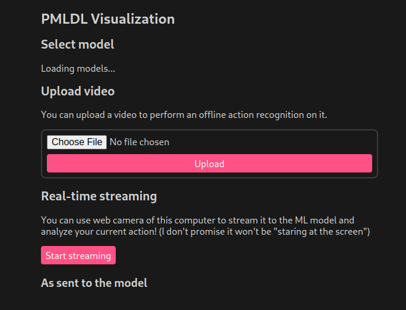

# Real-time human action recognition

The project is focused on UCF-50 dataset action recognition and provides a list of models from simple ConvLSTM to ViT from *vit-pytorch*:

|   Model       | UCF-50 accuracy |
| ------------- | ------------- |
| ResNetLSTM    |   0.84        |
| ViTModel      |   0.74        |
| LRCN          |   0.67        |
| ConvLSTM      |   0.58        |
| LRCN + Attention      |   0.93        |

# Web service
This project allows to use web-camera streams or loading the models via web service with nice interface.
You may upload a video or start streaming Web camera data right into the chosen model.





- To start the service run the following commands:
  ```
  ./start-front.sh
  ./start.sh
  ```

> To start front you might need to install npm:
> ```
> cd front
> npm install
> cd ..
> ```

# Models
- ResNetLSTM: \
Original model kaggle [notebook](
https://www.kaggle.com/code/yaryeva/pytorch-video-classification-with-conv2d-lstm) \
**Architecture:**
ResNet model with LSTM


- ViTModel \
Original model kaggle [notebook](https://www.kaggle.com/code/yaryeva/pmdl-vit) \
**Architecture:**
ViTModel


- ConvLSTM \
Original model kaggle [notebook](https://www.kaggle.com/code/yaryeva/pmdl-vit) \
**Architecture:**
ConvLSTM


- LRCN \
Original model kaggle [notebook](https://www.kaggle.com/code/yaryeva/pmldl-2-cnn-lstm) \
**Architecture:**
LRCN


- ResNet + LSTM with Attention \
Original model kaggle [notebook](https://www.kaggle.com/code/yaryeva/pmldl-cnn-lstm-with-attention/notebook) \
**Architecture:**
ResNet + LSTM with Attention


